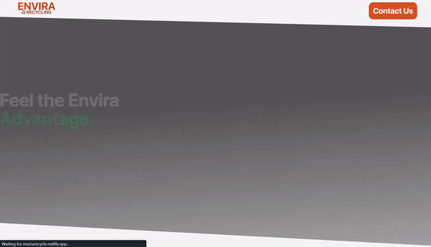
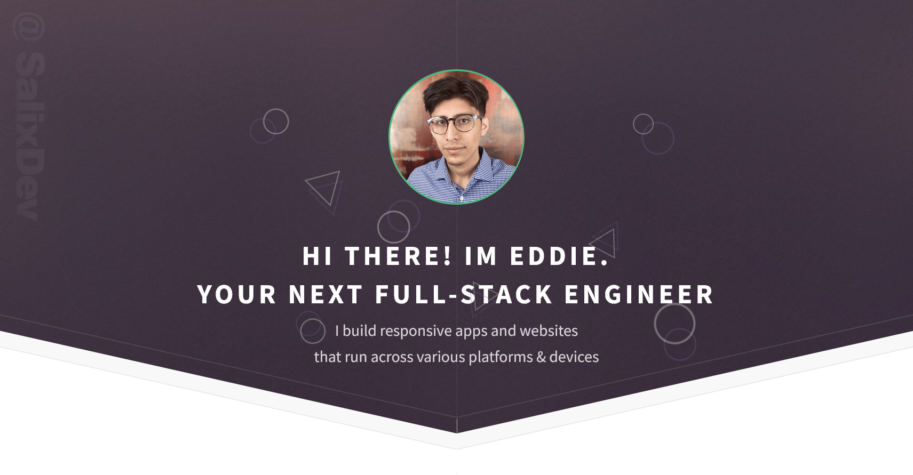
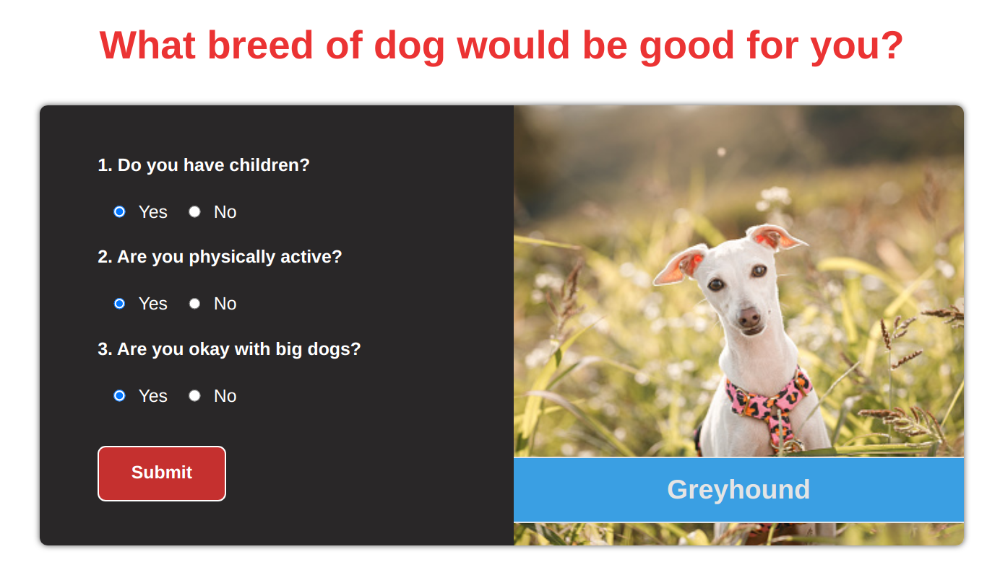

<h1 align="center">Hi 👋, I'm Eddie</h1>
<h3 align="center">A passionate full-stack developer from Texas</h3>

- 🔭 I’m currently working on [Philosopher Full Stack API](https://github.com/SalixDev/philosophers-api)

- 🌱 I’m currently learning **next.js**

- 💬 Ask me about **react, javascript, and video editing**

- 📫 How to reach me **hello@eddiesalcedo.com**

- 👨‍💻 My work is available at [eddiesalcedo.com](https://www.eddiesalcedo.com)

<!-- Socials -->
<h3 align="left">Connect with me:</h3>

<!-- Language and tools -->
<h3 align="left">Languages and Tools:</h3>

  
 
 
 
 
 
 
 
 
 
 
 
 
 
 
 
 

<!-- Projects -->
<h1 align="center">Projects</h1>
<table bordercolor="#66b2b2">
  
  <tr>
    <td width="50%" valign="top">
      <h3 align="center">Envira Recycling Landing Page</h3>
         
        
         
        

           
  
  
      

        
<strong>React, Javascript, CSS, HTML, Tailwind, and Netlify</strong> - A vivid and fully responsive website for a B2B model recycling company 

    </td>
    <td width="50%" valign="top">
      <h3 align="center">EddieSalcedo.com</h3>
         
      
         
        

          
  
  
      

      
<strong>Javascript, HTML5, CSS3, SASS/SCSS, and Netlify</strong> - Portfolio site. Display of projects, contact and social mediums, and contact form.

    </td>
  </tr>
  
  <tr>
    <td width="50%" valign="top">
      <h3 align="center">Base Apparel Newsletter Sign Up</h3>
         
        
         
        

          
  
  
      

        
<strong>Javascript, HTML5, CSS3</strong> - Responsive websites for Base Apparel. Elegantly communicates B2C message and allows customers to sign up to their newsletter! 

    </td>
    <td width="50%" valign="top">
      <h3 align="center">Dog Breed Selector App</h3>
       
        
       
        

  
  
      

        
<strong>Javascript, Node.js, HTML5, CSS3, and Hiroku</strong> - Application aids user in determining what dog breed best fits their lifestyle.

    </td>
  </tr>
</table>
